# FitForm 软件需求分析与开发指导（课程版）

> 文档目的：用于软件工程课程需求分析阶段，指导团队按“社区开发 + AI 模型开发”双主线推进实现。

## 1. 文档概述

### 1.1 文档基本信息
- 项目名称：FitForm
- 文档名称：软件需求分析与开发指导
- 文档版本：v1.0
- 编写日期：2026-04-11
- 适用阶段：需求分析、迭代计划、任务拆分
- 目标读者：产品负责人、后端/前端开发、AI 开发、测试、项目经理

### 1.2 文档范围
本文档覆盖：
- 软件系统的一般性描述
- 功能需求概述、优先级和迭代安排
- 用例模型、交互模型、分析类模型
- 非功能需求（外部质量、内部质量、开发约束）
- 面向组员分工的最小开发组件拆分

### 1.3 编写依据与已知前提
- 已确定技术路线：MediaPipe + BlazePose（优先 Full，低端机可回退 Lite）
- 已有能力基础：本地视频姿态分析、视频对比分析、HTTP API（/health, /analyze/image, /analyze/video, /compare/video）
- 产品定位：AI 实时动作评估 + 社区达人二次纠错
- 首版动作：深蹲（单人、正面、标准距离）

### 1.4 需求分析必要性（指导说明）
初步需求常见问题包括“不具体、不清晰、关系不明、潜在缺陷、缺乏优先级区分”。
因此本项目采用三视角精化：
- 用例视角：系统做什么（功能边界）
- 行为视角：系统如何做（对象交互）
- 结构视角：系统由什么概念组成（分析类关系）

---

## 2. 软件系统的一般性描述

### 2.1 系统目标
FitForm 面向健身新手，提供动作质量评估与纠错闭环：
- AI 负责实时识别和基础纠错，提高反馈效率
- 社区达人负责复核与个性化建议，提高反馈可靠性

### 2.2 业务边界
系统分为两条主线：
1. 社区开发主线（业务平台）
- 用户、帖子、评论、点赞、采纳、达人认证、通知
2. AI 模型开发主线（智能能力）
- 姿态检测、动作指标计算、反馈生成、报告输出、视频对比

### 2.3 目标用户与角色
- 普通用户（健身新手）：训练、看反馈、发帖求助
- 认证达人：回答求助、发布纠错建议
- 管理员：内容治理、达人审核、违规处理
- 系统服务：模型推理服务、规则引擎、消息服务

### 2.4 运行环境
- 客户端：移动端（后续可扩展 Web）
- 服务端：FastAPI/REST API + 数据库存储
- AI 推理：MediaPipe Tasks（单人姿态）
- 开发环境：Windows + Python 3.10~3.12

### 2.5 核心业务流程（总览）
1. 用户登录并开始训练
2. 系统实时识别姿态，生成分帧指标
3. 训练结束生成报告与建议
4. 用户可一键发帖上传片段和报告
5. 达人评论纠错，用户采纳并沉淀经验

---

## 3. 软件功能需求

### 3.1 软件功能概述
本系统功能分为 4 类：
1. 账户与身份功能
- 注册/登录、个人资料、角色识别（普通/达人/管理员）
2. AI 动作分析功能
- 图片/视频分析、动作评分、实时反馈、报告生成、双视频对比
3. 社区互动功能
- 发帖、评论、点赞、收藏、采纳最佳建议、消息通知
4. 运营与治理功能
- 达人认证、内容审核、举报处理、统计看板

### 3.2 软件功能需求优先级（含重要性、优先级、迭代安排）

#### 3.2.1 功能清单总表（必须列齐）
| 功能编号 | 功能名称 | 所属主线 | 重要性 | 优先级 | 依赖 | 迭代安排 |
|---|---|---|---|---|---|---|
| F01 | 用户注册/登录 | 社区 | 高 | P0 | 无 | Iter-1 |
| F02 | 用户资料管理 | 社区 | 中 | P1 | F01 | Iter-2 |
| F03 | 角色与权限控制（普通/达人/管理员） | 社区 | 高 | P0 | F01 | Iter-1 |
| F04 | 视频上传与训练任务创建 | AI | 高 | P0 | F01 | Iter-1 |
| F05 | 单视频姿态解析（/analyze/video） | AI | 高 | P0 | F04 | Iter-1 |
| F06 | 图片姿态解析（/analyze/image） | AI | 中 | P1 | F01 | Iter-2 |
| F07 | 双视频对比（/compare/video） | AI | 高 | P0 | F05 | Iter-2 |
| F08 | 动作指标计算（膝角/躯干角/稳定性） | AI | 高 | P0 | F05 | Iter-1 |
| F09 | 反馈生成（深度不足/前倾过大等） | AI | 高 | P0 | F08 | Iter-1 |
| F10 | 训练报告生成与查看 | AI | 高 | P0 | F08,F09 | Iter-1 |
| F11 | 发帖求助（携带视频片段与报告） | 社区 | 高 | P0 | F01,F10 | Iter-2 |
| F12 | 评论回复 | 社区 | 高 | P0 | F11 | Iter-2 |
| F13 | 点赞 | 社区 | 中 | P1 | F11 | Iter-2 |
| F14 | 收藏帖子 | 社区 | 中 | P2 | F11 | Iter-3 |
| F15 | 采纳最佳建议 | 社区 | 中 | P1 | F12 | Iter-3 |
| F16 | 通知中心（评论/点赞/采纳） | 社区 | 中 | P1 | F12,F13,F15 | Iter-3 |
| F17 | 达人认证申请与审核 | 社区 | 中 | P1 | F03 | Iter-3 |
| F18 | 举报与内容审核 | 社区 | 中 | P1 | F11,F12 | Iter-3 |
| F19 | 健康检查与服务状态（/health） | AI | 高 | P0 | 无 | Iter-1 |
| F20 | 模型与参数配置管理 | AI | 中 | P1 | F05 | Iter-2 |

#### 3.2.2 核心与外围划分（用于组内资源分配）
- 核心功能（必须先上线）：F01, F03, F04, F05, F08, F09, F10, F11, F12, F19
- 关键增强功能（第二梯队）：F06, F07, F13, F15, F20
- 外围功能（可延后）：F02, F14, F16, F17, F18

#### 3.2.3 双主线迭代计划
| 迭代 | 社区主线目标 | AI 主线目标 | 可验收里程碑 |
|---|---|---|---|
| Iter-1（第1~2周） | 登录/权限框架 | 单视频分析+评分+报告+健康检查 | 跑通“登录 -> 上传视频 -> 输出报告” |
| Iter-2（第3~4周） | 发帖、评论、点赞 | 图片分析、双视频对比、参数管理 | 跑通“报告 -> 发帖求助 -> 达人评论” |
| Iter-3（第5~6周） | 采纳、通知、认证、审核 | 指标优化与稳定性提升 | 形成“AI+社区闭环”可演示版本 |

### 3.3 软件功能需求描述

#### 3.3.1 软件的用例模型及描述

##### A. 总体用例列表
| 用例编号 | 用例名称 | 参与者 | 目标 |
|---|---|---|---|
| UC01 | 用户登录 | 普通用户/达人/管理员 | 建立会话，进入系统 |
| UC02 | 上传视频并分析动作 | 普通用户 | 获取关键点、评分与反馈 |
| UC03 | 查看训练报告 | 普通用户 | 了解问题与改进建议 |
| UC04 | 发帖求助 | 普通用户 | 获取达人二次纠错 |
| UC05 | 评论纠错建议 | 达人/普通用户 | 给出建议并互动 |
| UC06 | 点赞内容 | 普通用户/达人 | 表达认可并提升内容热度 |
| UC07 | 采纳最佳建议 | 普通用户 | 标记有效建议，形成闭环 |
| UC08 | 双视频动作对比 | 普通用户/达人 | 与标准动作做偏差分析 |
| UC09 | 达人认证审核 | 管理员 | 确保专家内容质量 |
| UC10 | 举报与内容审核 | 普通用户/管理员 | 控制社区违规内容 |

##### B. 总体用例图（Mermaid）
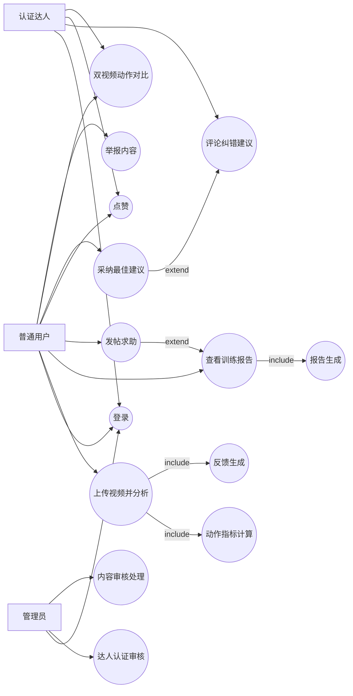

##### C. 详细用例描述（按优先级）

1) UC01 用户登录（P0）
- 触发条件：用户点击登录
- 前置条件：账号已注册
- 后置条件：系统创建会话并返回用户角色
- 基本流程：输入账号密码 -> 服务端校验 -> 返回 token 和角色 -> 跳转首页
- 备选流程：密码错误 -> 提示重试；账号冻结 -> 拒绝登录
- 异常流程：服务不可用 -> 返回错误码并建议稍后重试

2) UC02 上传视频并分析动作（P0）
- 触发条件：用户上传训练视频
- 前置条件：用户已登录，视频格式合法
- 后置条件：生成分帧姿态结果与基础指标
- 基本流程：上传视频 -> 创建任务 -> 抽帧 -> 姿态识别 -> 指标计算 -> 返回结果
- 备选流程：视频过长 -> 按 max_frames 截断
- 异常流程：模型不可用 -> 返回 503

3) UC03 查看训练报告（P0）
- 触发条件：用户打开某次训练记录
- 前置条件：已存在分析结果
- 后置条件：显示评分、关键问题、建议
- 基本流程：请求报告 -> 聚合指标 -> 生成建议 -> 渲染页面

4) UC04 发帖求助（P0）
- 触发条件：用户点击“去社区求助”
- 前置条件：有训练报告或视频片段
- 后置条件：帖子发布成功，进入社区流
- 基本流程：填写标题正文 -> 关联报告 -> 发布 -> 返回帖子 ID

5) UC05 评论纠错建议（P0）
- 触发条件：达人进入帖子详情并评论
- 前置条件：帖子存在且未关闭
- 后置条件：评论入库并通知发帖人

6) UC06 点赞内容（P1）
- 触发条件：用户点击点赞
- 前置条件：已登录
- 后置条件：点赞数+1，触发消息通知

7) UC07 采纳最佳建议（P1）
- 触发条件：发帖人点击“采纳”
- 前置条件：评论存在且属于该帖子
- 后置条件：评论状态变为已采纳，达人贡献值增加

8) UC08 双视频动作对比（P0）
- 触发条件：用户上传标准视频与自身视频
- 前置条件：两视频均可解析出足量有效帧
- 后置条件：返回偏差指标与对比反馈

9) UC09 达人认证审核（P1）
- 触发条件：管理员处理认证申请
- 前置条件：申请资料齐全
- 后置条件：申请通过/拒绝，角色更新

10) UC10 举报与内容审核（P1）
- 触发条件：用户举报帖子或评论
- 前置条件：目标内容存在
- 后置条件：管理员处理并记录结果

#### 3.3.2 用例的交互模型及描述（一个用例一个顺序图）

1) UC01 用户登录
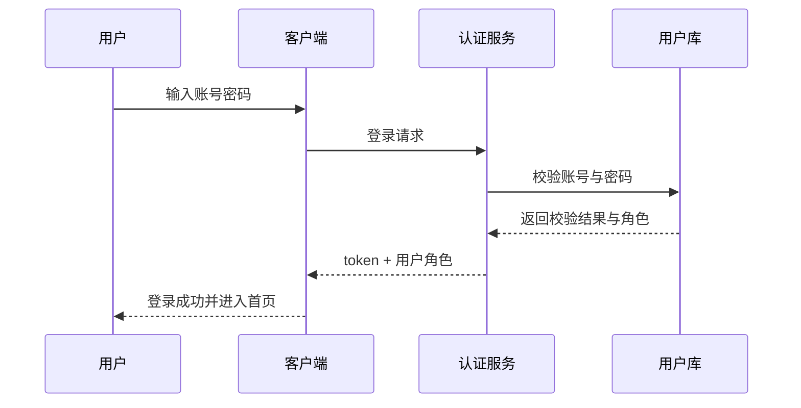

2) UC02 上传视频并分析动作
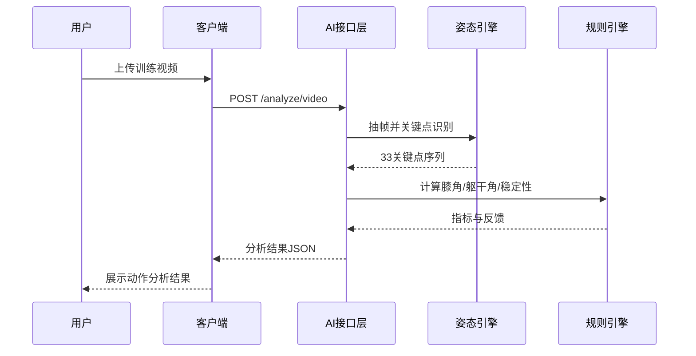

3) UC03 查看训练报告
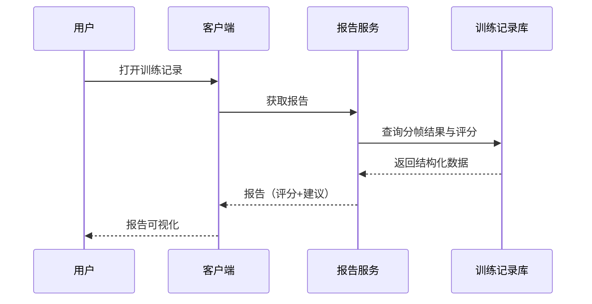

4) UC04 发帖求助
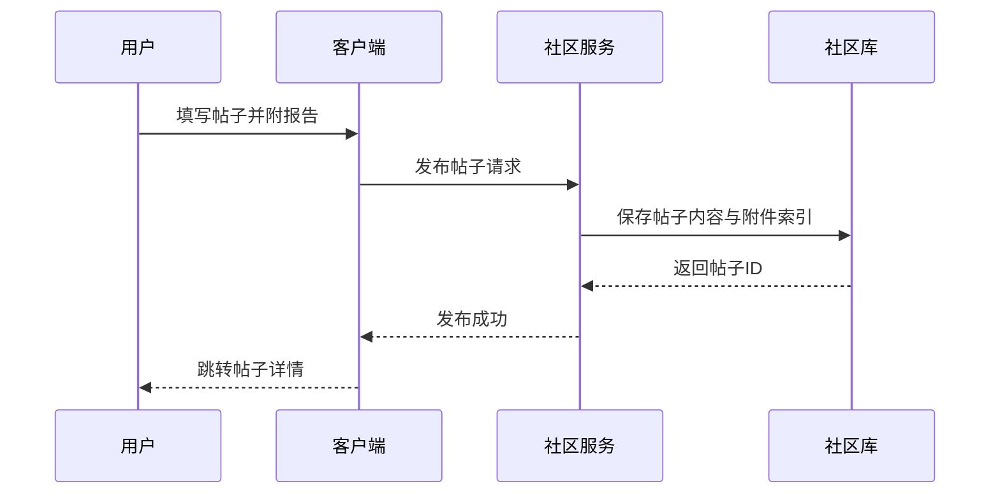

5) UC05 评论纠错建议
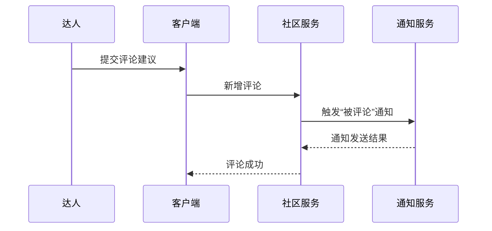

6) UC06 点赞内容
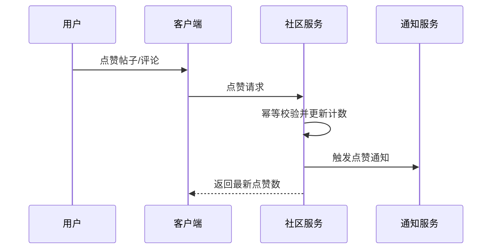

7) UC07 采纳最佳建议
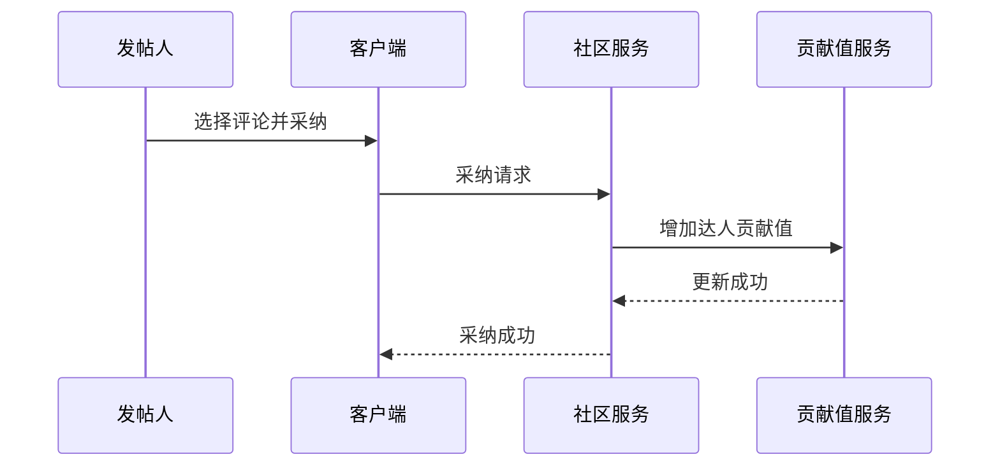

8) UC08 双视频动作对比
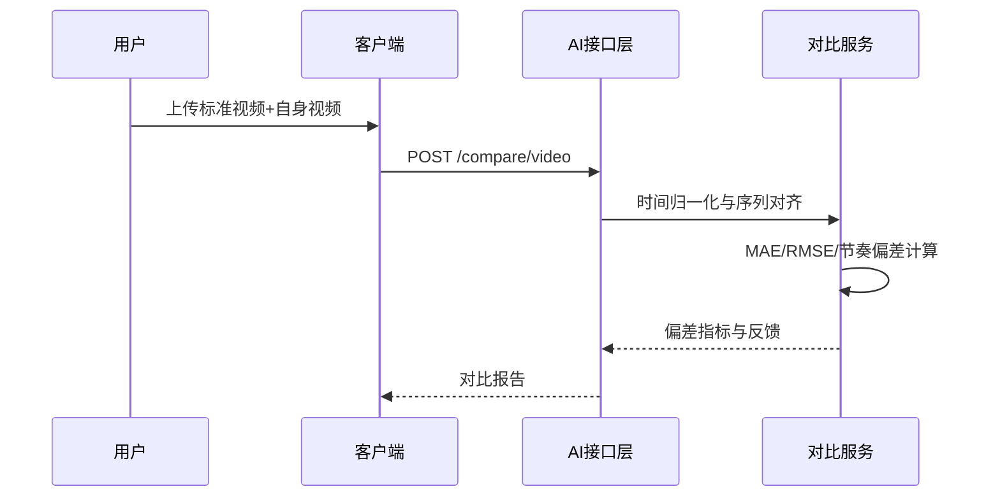

9) UC09 达人认证审核
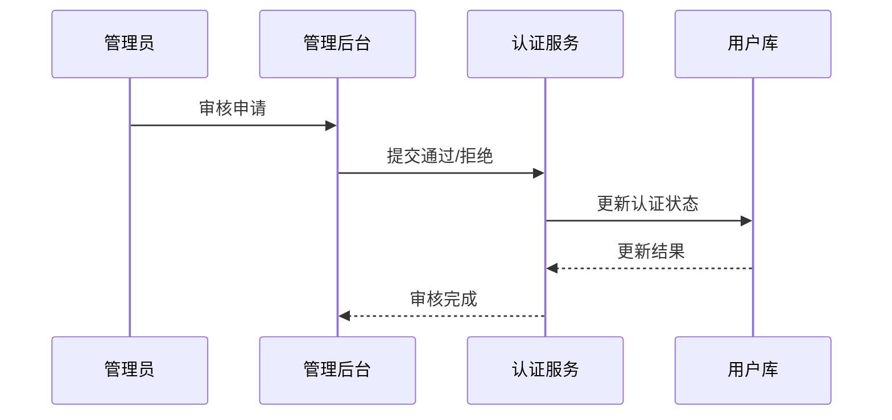

10) UC10 举报与内容审核
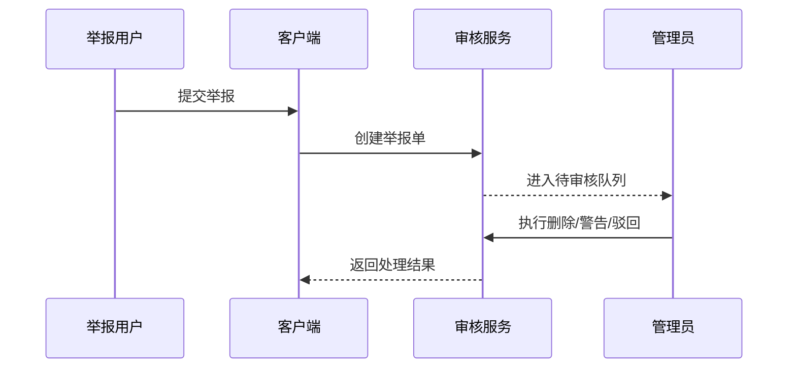

#### 3.3.3 软件需求的分析类模型及描述

##### A. 总体分析类图（可拆分为两个子系统）
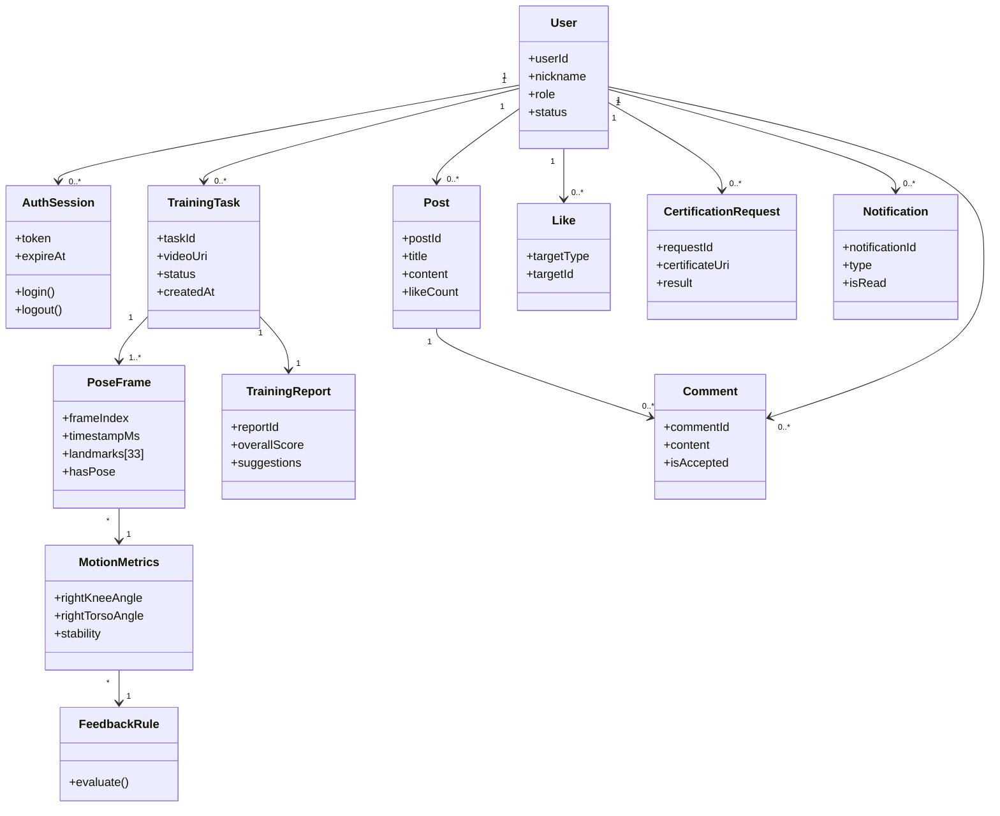

##### B. 自然语言说明
- 实体类：User、Post、Comment、TrainingTask、TrainingReport
- 边界类：移动端页面对象、API Controller
- 控制类：AuthService、PoseAnalyzeService、CompareService、CommunityService、ModerationService
- 关系重点：
  - TrainingTask 聚合 PoseFrame，PoseFrame 关联 MotionMetrics
  - TrainingReport 依赖 MotionMetrics + FeedbackRule 生成
  - Post 与 Comment 构成社区互动核心，Like/Notification 为支撑类

### 3.4 软件的非功能性需求

#### 3.4.1 外部质量需求
- 性能：
  - 单视频分析平均响应时间 <= 6s（限定 max_frames）
  - 关键接口成功率 >= 99%
- 可用性：
  - 登录、上传、发帖主路径可用性 >= 99.5%
- 可靠性：
  - 视频解析失败需返回明确错误码与原因
- 安全性：
  - 用户鉴权采用 token；关键接口需要登录
  - 上传文件类型与大小必须校验
- 兼容性：
  - 支持常见 mp4/mov 输入（按项目测试集验收）

#### 3.4.2 内部质量需求
- 可维护性：
  - 社区服务与 AI 服务模块解耦，API 合同稳定
- 可测试性：
  - 对动作指标计算、阈值判定、评论/点赞流程提供单元测试
- 可扩展性：
  - 动作类型（深蹲/俯卧撑/平板）通过配置扩展，不破坏主流程
- 可读性：
  - 统一命名规范与接口响应结构（meta/summary/frames）

#### 3.4.3 开发约束需求
- 项目周期约束：按 3 个迭代（6 周）推进
- 技术约束：首版固定 MediaPipe BlazePose，不引入重训练链路
- 资源约束：优先做可演示闭环，不做高成本多人场景
- 工程约束：Windows 路径兼容（模型路径非 ASCII 时需复制到临时 ASCII 路径）

---

## 4. 面向组员分工的最小开发组件拆分（指导重点）

### 4.1 社区开发主线（最小组件）
| 组件编号 | 组件名称 | 输入 | 输出 | 负责人建议 |
|---|---|---|---|---|
| C01 | 认证组件（注册/登录/token） | 账号密码 | token, role | 后端A |
| C02 | 用户资料组件 | 用户信息修改请求 | 更新后的 profile | 后端A/前端A |
| C03 | 帖子组件（CRUD） | 标题、正文、附件索引 | 帖子详情 | 后端B |
| C04 | 评论组件 | postId, comment | 评论列表 | 后端B |
| C05 | 点赞组件（幂等） | targetId, userId | likeCount | 后端B |
| C06 | 采纳组件 | postId, commentId | accepted 状态 | 后端B |
| C07 | 通知组件 | 事件流（评论/点赞/采纳） | 通知列表 | 后端C |
| C08 | 认证审核组件 | 达人申请资料 | 审核结论 | 后端C/管理端 |
| C09 | 内容审核组件 | 举报单 | 审核结果 | 后端C/管理端 |

### 4.2 AI 模型开发主线（最小组件）
| 组件编号 | 组件名称 | 输入 | 输出 | 负责人建议 |
|---|---|---|---|---|
| A01 | 模型加载组件 | 模型路径/环境变量 | 可用 landmarker 实例 | AI工程A |
| A02 | 视频预处理组件 | 原始帧 | 旋转/缩放/增强后帧 | AI工程A |
| A03 | 关键点检测组件 | 预处理帧 | 33关键点 | AI工程B |
| A04 | 指标计算组件 | 关键点序列 | 膝角/躯干角/稳定性 | AI工程B |
| A05 | 反馈规则组件 | 指标 | feedback tags | AI工程B |
| A06 | 报告生成组件 | 指标+反馈 | summary/report | AI工程C |
| A07 | 对比分析组件 | 标准与用户序列 | MAE/RMSE/节奏偏差 | AI工程C |
| A08 | API 网关组件 | HTTP 请求 | 统一 JSON 响应 | 后端AI |

### 4.3 组件级依赖图（文字）
- 社区链路：C01 -> C03 -> C04 -> C05/C06 -> C07
- AI 链路：A01 -> A02 -> A03 -> A04 -> A05 -> A06
- 对比扩展：A03 -> A07
- 跨主线集成：A06 产出报告 -> C03 发帖携带报告

### 4.4 组内任务排期建议
- 第 1 周：C01, A01, A02, A03（打通基础链路）
- 第 2 周：A04, A05, A06 + 最小前端展示
- 第 3 周：C03, C04（社区求助主路径）
- 第 4 周：A07, C05（增强互动与对比）
- 第 5 周：C06, C07, C08（闭环与治理）
- 第 6 周：联调、测试、答辩演示脚本固化

